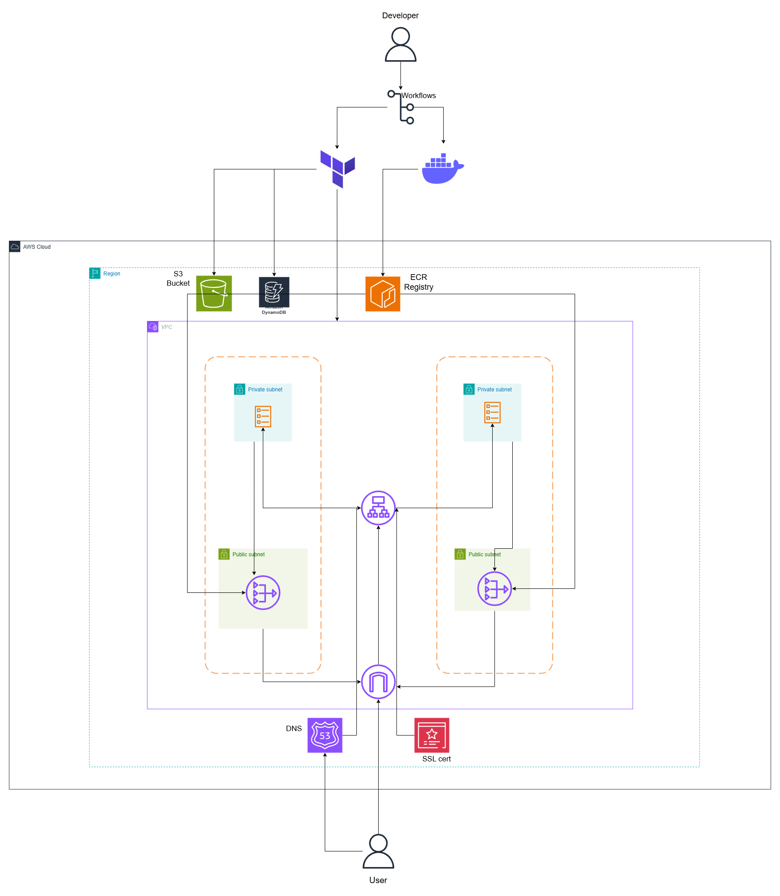

# Gatus ECS Project

## Table of Contents
1. [Project Overview](#project-overview)  
2. [Architecture](#architecture)  
3. [Folder Structure](#folder-structure)  
4. [Infrastructure](#infrastructure)  
5. [Application](#application)  
6. [Deployment](#deployment)  
7. [Testing](#running-locally)  
  

---

## Project Overview
This project deploys **Gatus**, a service monitoring tool, on **AWS ECS Fargate** using **Terraform**.  

Key features:  
- Containerized deployment using **Docker**  
- ECS Fargate for serverless container execution  
- Public-facing **ALB** routing to ECS tasks  
- Infrastructure as code via **Terraform modules**  
- CI/CD pipeline with **GitHub Actions**  
- Infrastructure includes **VPC, ALB, ECS, ACM, ECR, Security Groups, IAM, Route 53**  

---

## Architecture
<p align="center">
  
</p>


High-level traffic flow:

- **ALB**: Public-facing load balancer for routing traffic  
- **ECS Tasks**: Runs Gatus container in private subnets  
- **NAT Gateway**: Provides outbound internet access for ECS tasks  
- **Route 53**: Manages DNS records pointing domain/subdomain to ALB  
- **Terraform Modules**: Modular, reusable infrastructure for maintainability  

---

## Folder Structure

```text
gatus-ecs-project/
├── app/
│   ├── Dockerfile
│   ├── config.yaml         
│   ├── go.mod
│   ├── go.sum        
│   └── main.go           
│
├── infra/
│   ├── main.tf            
│   ├── variables.tf       
│   ├── provider.tf        
│   └── modules/
│       ├── vpc/
│       │   ├── main.tf
│       │   ├── variables.tf
│       │   └── outputs.tf
│       ├── alb/
│       │   ├── main.tf
│       │   ├── variables.tf
│       │   └── outputs.tf
│       ├── ecs/
│       │   ├── main.tf
│       │   ├── variables.tf
│       │   └── outputs.tf
│       ├── acm/
│       │   ├── main.tf
│       │   ├── variables.tf
│       │   └── outputs.tf
│       ├── ecr/
│       │   ├── main.tf
│       │   ├── variables.tf
│       │   └── outputs.tf
│       ├── security_groups/
│       │   ├── main.tf
│       │   ├── variables.tf
│       │   └── outputs.tf
│       ├── iam/
│       │   ├── main.tf
│       │   ├── variables.tf
│       │   └── outputs.tf
│       └── route53/
│           ├── main.tf
│           ├── variables.tf
│           └── outputs.tf
│
└── .github/
    └── workflows/
        ├── ci.yml          # CI: build Docker, scan, push to ECR
        ├── cd.yml          # CD: Terraform apply, update ECS tasks
        └── manual-destroy.yml

```
---

## Infrastructure
### Terraform Modules
- **VPC**: Public/private subnets, route tables, NAT Gateway  
- **ALB**: Application Load Balancer, listeners, target groups  
- **ECS**: Cluster, services, and task definitions  
- **ACM**: SSL/TLS certificate management  
- **ECR**: Docker image repository  
- **Security Groups**: Access management for ALB and ECS tasks  
- **IAM**: ECS execution/service roles  
- **Route 53**: DNS records for domain/subdomain  

Modules allow modular, reusable, and maintainable infrastructure.

---

## Application
- **Dockerfile**: Builds the Gatus container  
- **config.yaml**: Service monitoring configuration  
- **main.go**: Entry point for custom logic if needed  
- **go.mod / go.sum**: Go module dependencies  

Docker images are built and pushed to **ECR** using GitHub Actions, with commit SHA tags for versioning.

---

## Deployment
### CI/CD Pipeline
**CI Workflow (`ci.yml`)**
1. Checks out code  
2. Builds Docker image from `/app`  
3. Scans image for vulnerabilities  
4. Pushes Docker image to **ECR**

**CD Workflow (`cd.yml`)**
1. Runs Terraform `plan` and `apply`  
2. Updates ECS service with new Docker image (commit SHA)  
3. Performs zero-downtime deployments via ECS Fargate  

**Optional: Manual Destroy (`manual-destroy.yml`)**
- Allows you to destroy resources safely if needed  

### Manual Terraform Commands
```bash
cd infra
terraform init
terraform plan
terraform apply -auto-approve

```


### Running Locally

You can run Gatus locally using Docker to test your configuration before deploying to AWS:

1. **Build the Docker image**

```bash
cd app
docker build -t gatus-local:latest .

```

2. **Run Container**

```bash
docker run -d -p 8080:8080 gatus-local:latest

```
3. **Test Locally**

```bash
curl http://localhost:8080/health
```
You should see:

{"status":"UP"}% 

